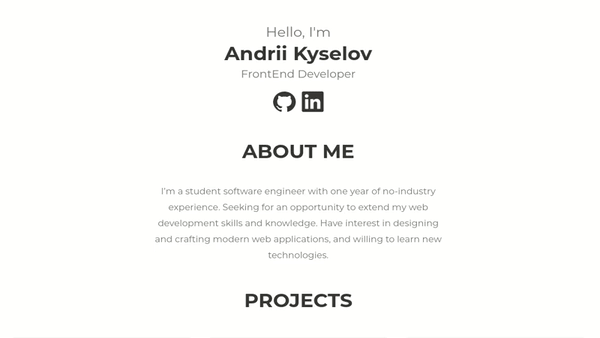

# Portfolio Website

Minimalistic portfolio website. Written with React.js, HTML and CSS.  

## Prerequisites

Install [node.js](https://nodejs.org/en/) and [npm](https://www.npmjs.com/).

## Getting Started

#### Clone repository:

`git clone https://github.com/IselDrew/iseldrew.github.io.git`

#### Install dependencies:

`npm install`

#### Start application:

`npm start`

## Application preview

[Live demo](https://iseldrew.github.io/)

## Acknowledgments

Special thanks to [Mykyta Morar](https://www.artstation.com/mykytam) for great and simple design.
